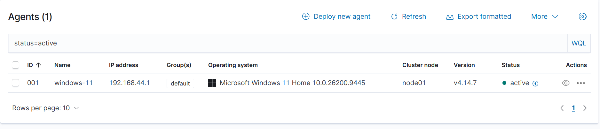
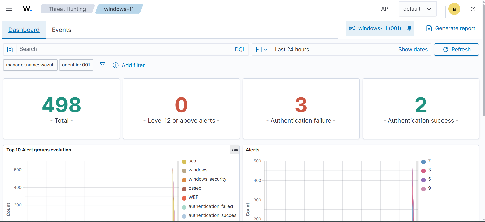
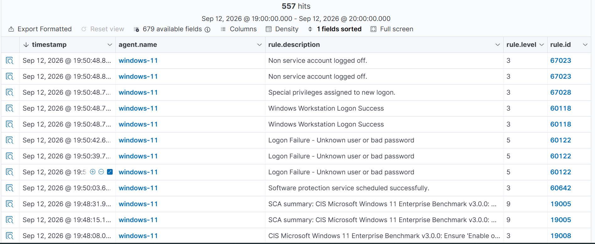
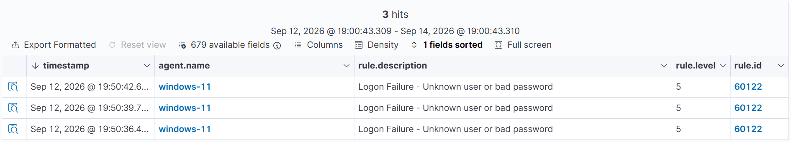
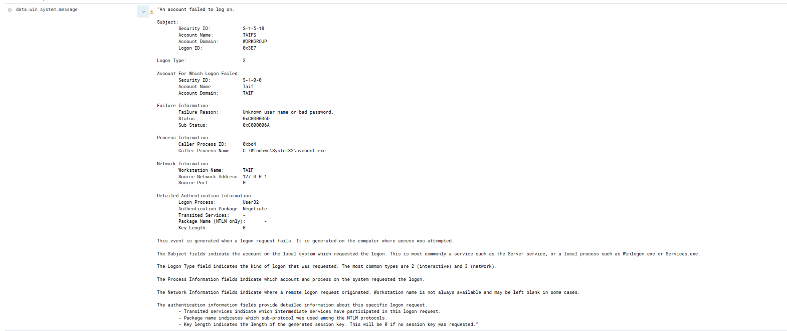
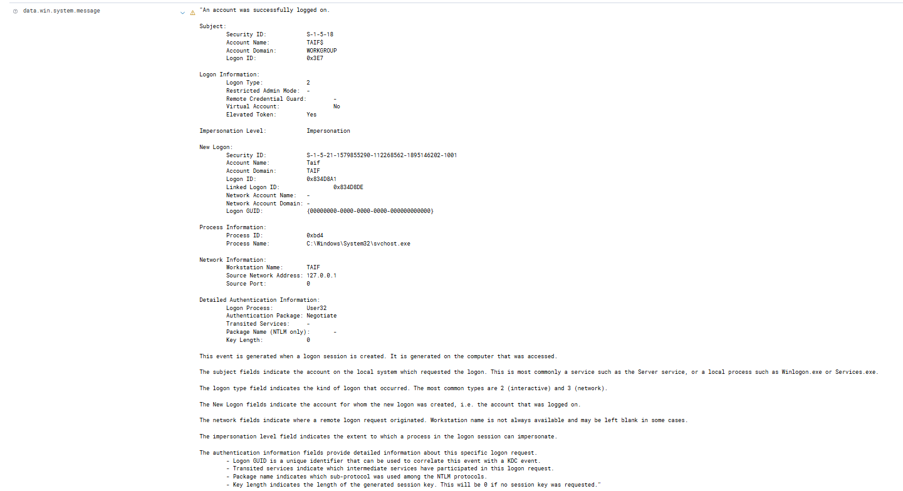

# Windows 4625 Authentication Failure Investigation using Wazuh

## 📌 Project Overview

This project demonstrates a Security Operations Center (SOC) investigation of failed Windows authentication attempts using **Wazuh SIEM**.

The activity was performed in an authorized home lab environment to validate Windows Security Event monitoring, alert generation, event analysis, and basic incident investigation.

---

## 🎯 Objectives

- Monitor Windows authentication events using Wazuh.
- Detect failed login attempts.
- Investigate Windows Security Event ID 4625.
- Analyze authentication-related event fields.
- Correlate failed and successful login activity.
- Perform a basic SOC-style investigation and determine whether the activity is malicious or benign.
- Document findings and evidence professionally.

---

## 🏗️ Lab Environment

| Component | Details |
|---|---|
| SIEM | Wazuh 4.14.7 |
| Wazuh Manager | Ubuntu Server |
| Endpoint | Windows 11 Home |
| Wazuh Agent | windows-11 |
| Agent ID | 001 |
| Virtualization | VMware |
| Network | NAT |
| Activity | Authorized lab testing |

---

## 🔧 Tools & Technologies

- Wazuh SIEM
- Wazuh Agent
- Windows Event Viewer
- Windows Security Logs
- VMware
- Windows 11
- Ubuntu Server

---

## 🔍 Detection Details

During the lab exercise, multiple incorrect login attempts were intentionally generated on the Windows endpoint.

Wazuh detected the authentication failures and generated alerts based on Windows Security Event ID **4625**.

### Alert Information

| Field | Value |
|---|---|
| Event ID | 4625 |
| Wazuh Rule ID | 60122 |
| Rule Level | 5 |
| Event | Logon Failure |
| Target User | Taif |
| Logon Type | 2 - Interactive |
| Source IP | 127.0.0.1 |
| Failure Reason | Unknown user name or bad password |
| Status | 0xC000006D |
| SubStatus | 0xC000006A |
| Failed Attempts | 3 |

---

## 🕒 Incident Timeline

| Time | Activity |
|---|---|
| 19:50:36 | Failed login attempt |
| 19:50:39 | Failed login attempt |
| 19:50:42 | Failed login attempt |
| 19:50:48 | Successful login |

The failed authentication attempts were followed by a successful login.

---

## 🧪 Investigation Findings

The investigation identified the following:

1. Windows generated Security Event ID 4625 for the failed authentication attempts.
2. Wazuh successfully collected and analyzed the Windows security events.
3. Wazuh generated Rule **60122** for the failed authentication activity.
4. Three failed login attempts were observed.
5. The authentication request used **Logon Type 2**, indicating an interactive logon.
6. The recorded source address was **127.0.0.1**, indicating local activity in this lab scenario.
7. The failed attempts were followed by a successful authentication event.
8. The activity was intentionally generated as part of an authorized security monitoring exercise.

---

## 🚨 Analyst Assessment

**Verdict: Benign / Authorized Lab Activity**

The observed authentication failures were intentionally generated for testing Wazuh's detection and monitoring capabilities.

Although the event pattern can resemble password-guessing activity, the investigation context confirmed that this was controlled lab activity rather than an actual attack.

### Analyst Confidence

**High**

---

## 🛡️ Recommended SOC Response

For a real-world environment, repeated Event ID 4625 alerts should be investigated further.

Recommended actions include:

- Identify the source IP address.
- Determine whether the source is internal or external.
- Identify the targeted account.
- Review the number and frequency of failed attempts.
- Check for successful authentication after multiple failures.
- Correlate authentication events with other security logs.
- Investigate unusual geographic or network sources.
- Consider account lockout or additional authentication controls where appropriate.

---

## 🗺️ MITRE ATT&CK Context

Authentication-related activity can be associated with techniques involving credential access and account compromise.

However, **MITRE ATT&CK mapping alone does not prove that an attack occurred**. In this lab, the activity was intentionally generated and assessed as benign.

---

## 📸 Evidence

### Wazuh Agent Status

### Wazuh Dashboard

### Authentication Alert Timeline

### Windows Event ID 4625

### Wazuh 4625 Evidence

### Successful Login

---

## 📄 Investigation Report

The complete investigation report is available here:

[View SOC Incident Investigation Report](Report/Windows-4625-SOC-Incident-Report.pdf)

---

## 📚 Key Learning Outcomes

Through this lab, I practiced:

- Windows authentication event analysis
- Event ID 4625 investigation
- Wazuh SIEM monitoring
- Wazuh rule and severity analysis
- Basic SOC alert triage
- Event timeline analysis
- Benign vs. suspicious activity assessment
- Security incident documentation

---

## ⚠️ Disclaimer

This project was performed in an isolated and authorized home lab environment for educational and cybersecurity training purposes.

No unauthorized systems or accounts were targeted.